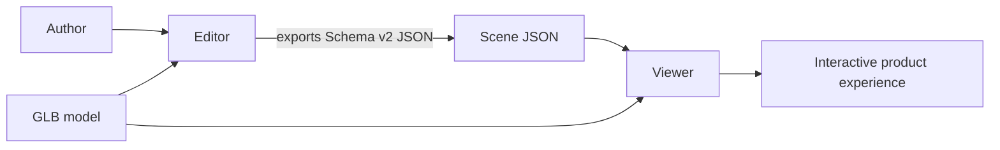
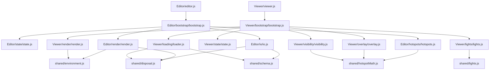

# Architecture

## High-level architecture

3D App Viewer contains two independent browser applications connected by a Schema v2 JSON document and a shared model filename convention.

Both applications use native ES modules and Three.js from an import map. Shared runtime primitives reside in `/shared/`, allowing both Editor and Viewer to consume consistent math, disposal, environment, and schema validation logic.

## Module responsibilities

### Shared Primitives (`/shared/`)

| Module | Responsibility |
| --- | --- |
| `shared/schema.js` | Canonical Schema v2.0.0 definition, validator, and migration engine for scene documents. |
| `shared/CameraRig.js` | Multi-pivot camera orbit rig with unconstrained yaw/pitch, damping, auto-rotate turntable, and default view handling. |
| `shared/disposal.js` | Safe, recursive Three.js resource disposal for meshes, geometries, materials, textures, and PMREM maps. |
| `shared/environment.js` | HDR presets, RGBELoader, PMREM generation, background mode handling (color, environment, transparent), tone mapping, and exposure. |
| `shared/lights.js` | Factory functions to instantiate and synchronize Schema v2 lights (`DirectionalLight`, `PointLight`, `SpotLight`, `AmbientLight`) in Three.js scenes. |
| `shared/hotspotMath.js` | Hotspot screen projection (`projectToScreen`), geometric occlusion raycasting (`testHotspotOcclusion`), and SVG connector lines (`calculateConnectorLine`). |

### Editor (`/Editor/`)

| Module | Responsibility |
| --- | --- |
| `editor.js` | Viewport acquisition, render loop initialization, and Editor bootstrap. |
| `state/state.js` | Shared mutable state: scene objects, DOM references, selection, gizmo state, and scene settings. |
| `render/render.js` | Viewport rendering, CameraRig initialization, visual helpers (grid/axes), environment loading, and render loop. |
| `bootstrap/bootstrap.js` | Module coordination, toolbar event binding, universal selection routing, and per-frame updates. |
| `hotspots/hotspots.js` | Hotspot creation, dragging, inspector binding, and shared math projection. |
| `selection/selection.js` | Universal selection system for hotspots, lights, models, meshes, and cameras. |
| `gizmo/gizmo.js` | TransformControls integration for translate, rotate, and scale operations. |
| `inspector/inspector.js` | Dynamic property inspector for inspecting and editing properties of selected scene entities. |
| `hierarchy/hierarchy.js` | Scene Outliner / Hierarchy tree view with real-time filtering, visibility toggling, and framing. |
| `lights/lights.js` | Interactive light authoring (Directional, Point, Spot, Ambient) with editor sprites and helpers. |
| `io/io.js` | Scene GLB and Schema v2 JSON import, export, migration, and error reporting. |

### Viewer (`/Viewer/`)

| Module | Responsibility |
| --- | --- |
| `viewer.html` | Presentation viewer layout, navigation header, upload triggers, and SVG overlay container. |
| `viewer.js` | Application entry point initiating Viewer bootstrap. |
| `bootstrap/bootstrap.js` | Coordinates viewer subsystems, sets up DOM events, and runs per-frame update loop. |
| `state/state.js` | Viewer runtime state singleton. |
| `render/render.js` | WebGLRenderer setup, OrbitControls, animation loop, and background/tone-mapping syncing. |
| `loading/loader.js` | GLTF/Draco 3D model loading, resource disposal, auto-framing, and Schema v2 JSON auto-discovery & loading. |
| `lights/lights.js` | Presentation lighting manager syncing custom Schema v2 lights or fallback default lights. |
| `overlay/overlay.js` | DOM generation for hotspot markers and information panels, SVG connector lines, and screen positioning. |
| `visibility/visibility.js` | Throttled occlusion testing against model geometry. |
| `style.css` | Styles for viewer layout, header, hotspot markers, information cards, and animated SVG lines. |
| `assets/Products/` | Bundled product GLB and matching Scene JSON files. |

## Dependency flow

Both applications avoid circular imports. Feature modules depend downward on state and shared primitives.

## Hotspot system & Projection

Hotspot coordinates are world-space positions. Every frame:
1. `testHotspotOcclusion` checks if the hotspot is behind the camera plane or occluded by model geometry.
2. `projectToScreen` converts 3D world coordinates to screen pixel offsets within the viewport.
3. `calculateConnectorLine` computes endpoints for the animated SVG connector line from the marker to the info card.
