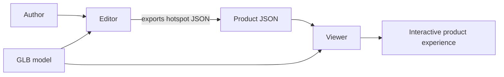
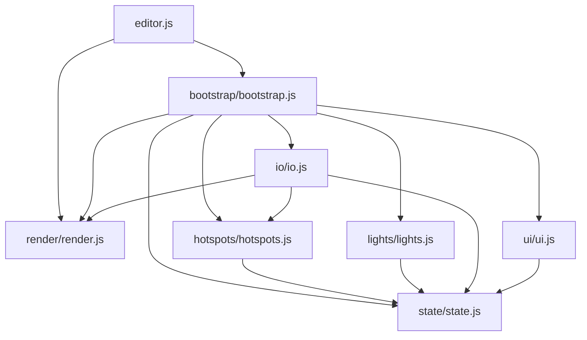
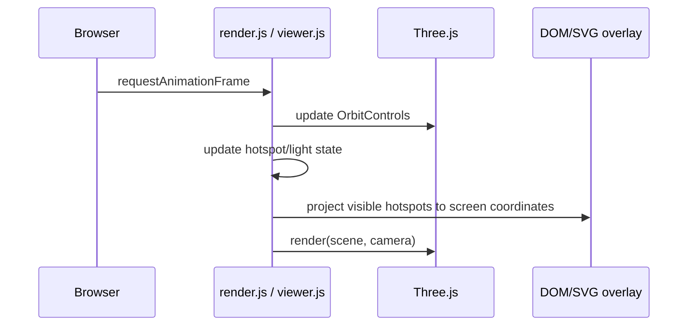

# Architecture

## High-level architecture

3D App Viewer contains two independent browser applications connected by a JSON document and a shared model filename convention.

Both applications use native ES modules and Three.js from an import map. They currently load supporting resources—Three.js, Draco decoder files, HDR environment, and some helper textures—from remote URLs.

## Module responsibilities

### Editor

| Module | Responsibility |
| --- | --- |
| `editor.js` | Gets the viewport, initializes rendering, configures GLTF/Draco loading, and starts the Editor. |
| `state/state.js` | Owns the shared mutable Editor state: scene objects, DOM references, collections, selection, and settings. |
| `render/render.js` | Creates the scene, camera, WebGL renderer, controls, default lighting/environment, resize behavior, model framing, and animation loop. |
| `bootstrap/bootstrap.js` | Coordinates module initialization, canvas clicks, selection, add mode, field binding, and per-frame updates. |
| `hotspots/hotspots.js` | Creates hotspot data and DOM overlay elements; manages selection, dragging, panel content, projection, visibility, and removal. |
| `lights/lights.js` | Creates and edits directional lights and their editor-only sprites, helper, target, and line. |
| `io/io.js` | Imports GLB and JSON files, exports JSON, and reports import errors. |
| `ui/ui.js` | Handles non-scene UI behavior, currently the sidebar toggle. |

### Viewer

| Module | Responsibility |
| --- | --- |
| `viewer.html` | Defines the viewer page, import control, and overlay container. |
| `viewer.js` | Initializes Three.js, loads the selected GLB and matching JSON, builds overlay DOM, determines hotspot visibility, and renders frames. |
| `style.css` | Styles the canvas, hotspot marker, information panels, lines, and upload control. |
| `assets/Products/` | Holds published product GLB/JSON pairs. |

## Dependency flow

The Editor intentionally uses one-way ES module imports. Feature modules depend on `state`; `bootstrap` coordinates features; the entrypoint starts the application.

There are no intended circular imports. New modules should depend downward on stable primitives and must not import the bootstrap module.

## State management

The Editor uses the singleton exported by `state/state.js`. It contains:

- Three.js objects: `scene`, `camera`, `renderer`, `controls`, and `raycaster`.
- DOM references: viewport, overlay, hotspot SVG, and sidebar controls.
- Domain collections: `currentModel`, `hotspots`, and `lights`.
- Selection state: `selection.hotspot` and `selection.light`, exposed through `selected` and `selectedLight` accessors.
- Interaction state: mode, add-mode flag, and hotspot-drag state.
- Scene settings and the preferred export filename.

State is mutable by design today. Modules should update only the fields they own and avoid adding duplicate representations of the same data.

## Rendering pipeline

Each application creates a `THREE.Scene`, perspective camera, `WebGLRenderer`, and `OrbitControls`. Both enable sRGB output, ACES filmic tone mapping, a directional light, ambient light, and an HDR environment. The Editor caps device pixel ratio at `1.5`; the Viewer uses a fixed quality scale of `0.8`.

Hotspot coordinates are world-space positions. Every frame, they are projected through the camera to position HTML markers and panels. A ray from the camera to the hotspot checks whether the current model occludes it.

## Selection system

Selection is Editor-only.

- Clicking a hotspot selects it and fills the hotspot inspector fields.
- Clicking a light sprite selects its directional light and fills the light controls.
- Clicking empty model space deselects the active hotspot.
- Add mode uses a raycast against `currentModel` to place one new hotspot.

The current system has distinct hotspot and light selection paths. Future universal selection should build on these behaviors instead of creating competing selection state.

## Hotspot system

A hotspot is a domain object with an ID, title, description, world-space position, panel offset, and runtime references to its DOM marker, panel, and SVG line. The Editor creates and updates those references; export omits them and writes only serializable fields.

Hotspots can be placed by clicking the model, moved by dragging their marker over the model, and edited through the inspector. Panels are draggable in screen space. The Viewer creates equivalent DOM overlays from the JSON but exposes them as hover interactions rather than editing controls.

## Lighting system

The Editor initializes ambient and directional lighting for the scene. Its light tool can add directional lights with an `Object3D` target, marker sprites, a helper, and a connecting line. The tool supports color, intensity, position, target, and shadow checkbox editing.

These light-tool objects are currently Editor-only: light collections are not serialized and the Viewer uses its own fixed ambient/directional setup. Do not imply that exported JSON reproduces Editor light edits until scene serialization supports it.

## UI responsibilities

HTML defines stable control IDs; feature modules bind behavior to those controls. CSS owns visual layout. Three.js renders only the 3D scene, while hotspot markers, panels, and connector lines are DOM/SVG overlay elements. Keep visual changes in CSS and interaction/data behavior in JavaScript modules.
